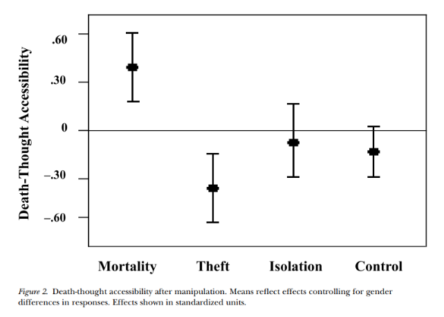
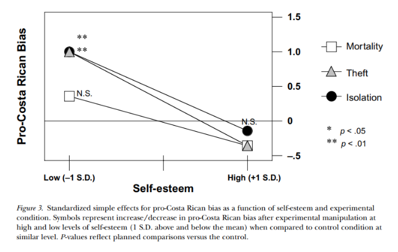
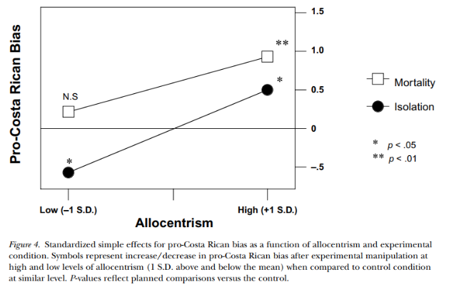

<!-- 
_class: title
headingDivider: 1
_paginate: false
 -->
# Navarrete et al., (2004)の まとめ
## TMTの批判と代替理論の提案

# はじめに
先生から頂きたいフィードバックは以下です。最後のページに再掲してます。以下を念頭にお読みいただきたいです。
1. **お褒めの言葉**（私にとって重要です！）
2. 論文のまとめ方に対する改善点
3. TMTが進化心理学ではない理由は間違いないか
4. 課題の方向性は適切か
5. Kirkpatric & Navarrete(2006)の後に読むと良い論文
   - 一本頂きたいです

# 目次
<!-- class: slides -->
- [TMTとは](#tmtとは)
- [TMTの問題点](#tmtの問題点)
- [TMTの代替理論](#tmtの代替理論)
- [高橋の感想と課題](#高橋の感想と課題)
- [先生から頂きたいフィードバック(再掲)](#先生から頂きたいフィードバック再掲)

# TMTとは
<!-- _class: section -->

# TMTの説明
1. 人間の自己省察的思考は多様な環境で適応的だった
2. しかし、その思考ゆえに、自らの死を意識できた
3. その死への意識は、あらゆる努力が死によって無駄になることを想定させた
4. その不安は慢性的に生じるはずである
5. この不安を解消するために、ヒトは文化的世界観を構築した

（続く）

# TMTの説明
6. そのため、文化的世界観が脅かされる（＝死の恐怖が顕現する）と、文化的世界観への信頼を強める
7. それによって、私たちは死への不安を低減しているのだ
とする理論のことである。

# 補足
この理論から導かれる仮説で代表的なものとして、 **文化的不安緩衝装置仮説** (Cultural Anxiety Buffer Hypothesis; CAB仮説)と**存在驚異顕現化仮説** (Mortality Salience Hypothesis; MS仮説)がある。
- CAB仮説は「文化的世界観や自尊心が強いもの、また状態的に強化されている者は、死の予期から受ける驚異が小さい」(脇本, 2005)という仮説
- MS仮説は「死の驚異が高まる(MS処理を受ける)と、文化的不安緩衝装置に対する欲求が高まる」(脇本, 2005)という仮説

# TMTの問題点
<!-- _class: section -->

# 生存本能の仮定と不安低減の適応機能
TMTは、２つの点で問題がある
1. 生存本能の仮定
2. 不安軽減の適応機能という考え

次のスライドからは、何が問題なのかを指摘する
# まず生存本能の仮定の問題点
- TMTでは、人間の死を予期できる認知機能が不安をもたらし、結果的に文化的世界観を強めるとしている。
- しかし、生存本能はすべての生物が持っているとすると、このような現象が人間のみに備わっていると考えるのは非論理的である。
  - 例えば崖から落ちることを回避するのは、死を回避することと同義であるが、それは死の概念を用いなくても回避可能である。

人間にのみ、死を回避する「生存本能」の仮定は妥当ではないだろう。

# 不安軽減の適応機能という考えの問題点
- 例えば、電車が近づいていることに不安を抱く人は、文化的世界観によって安心を得るかもしれないが、根本的な脅威はそのままである。
  - そのため、死や危険に対するより適応的な反応は、不安の軽減ではなく、その出来事を低減する行動を起こすことであると考えられる。
- また、不安低減の機能が備わっていたとしても、「不安の過剰反応→過剰反応の調整」ではなく、過剰な反応の抑制を選択する理由は提供されていない。

# TMTの代替理論
<!-- _class: section -->

# 何を仮定するか
では文化的世界観を強める集団間バイアス（Mortality Salience Effect:MS効果）はなぜ生じるのだろうか。それは、
- 社会的ネットワーク
- 対人愛着
- 連合の形成を促進する適応的メカニズムのシステム

によって説明できる。

# 文化基準内面化の適応的機能
Hallowell (1963,1963）は、集団内の個人が適応するかどうかは、文化基準を内面化することが重要であると論じた。（この考え方は、**進化ゲーム理論モデルとも一致**）

- if:規範遵守 → 社会的利得の上昇のために規範の内在化があるなら
  - さらにその社会的利得が特に重要な状況では、連合によって解決できる問題に直面したとき、 
- then:連合の形成と維持を行うための規範支持を行うように人間の心は進化しただろう。

<cite>多くの社会的認知研究によって、規範の内在化が重要であることは既に示されている(Aron, Aron, Tudor, & Nelson, 1991; Baldwin, 1992; Hardin & Higgins 1996; Leary, 2000; Schaller & Conway, 1999）。</cite>

# 具体的なプロセス
ヒトが対人関係を構築・維持する重要な方法の一つは相互理解である。
- 人が他者に自己呈示するときは、自分がよく見られるように呈示する（Baumeister & Leary, 1995; Schaller & Conway, 1999）。
- もし、人々が相手(集団)の魅力度によって話す内容を変えるなら（Hardin & Conley, 2001）、相手(集団)の評価も変わるだろう(Schaller & Conway, 1999）。
- 社会的葛藤があるときに社会的関係が特に重要になることから※、ヒトは特定の回避的刺激にあうと、内集団への規範を肯定する態度が増加するはずである。

<cite>（Baumeister & Leary, 1995; Tooby & Cosmides, 1996）</cite>

# 検証する仮説
- MS処理以外でもpro-ingroupな態度が増加すること
  - 所有物の盗難と社会的孤立の操作
- 採用したMS処理以外の処理(i.e. 盗難と孤立)は死の概念を顕現させないこと
  - 単語完成課題で測定
- MS効果は、自尊心が低い人、権威主義志向が高い人に顕著である
- 上記の効果は、異なる文化圏でも観測されること

上記仮説は全て支持された。

# 実験結果
<!-- _class: section -->

# S1:MSでなくとも集団間バイアスは増加

# S2:各処理は死を顕現させていない

# S3:S1の結果は異文化でも再現された

# S4:S1,3を再現＋MS効果はコスタリカで顕著

<cite>UCLA学生では、社会的孤立＝盗難＜MSで集団間バイアス増加したが、コスタリカではMS＜社会的孤立で集団間バイアスが増加した。これは文化的差異を明確に説明している可能性。</cite>

# 高橋の感想と課題
<!-- _class: section -->

# TMTはなぜ進化心理学ではないか？
進化心理学必要なものは、進化ゲーム理論モデルをもとにした推論なのかなと感じました。つまり、本文で言う
- <small>A. I. Hallowell (1956, 1963), who argued that the internalization of cultural standards is crucial for individual adaptive coordination within groups, a notion consistent with evolutionary game-theoretic models that emphasize the adaptive utility of conformity to social norms in order to enhance the efficiency of coordination among self-interested actors engaged in mutualistic cooperation (e.g. McElreath, Boyd, & Richerson, 2003)</small>

に尽きるなと思いました。

# TMTはなぜ進化心理学ではないか？
したがって、TMTが進化心理学でないのは
1. 個人の適応度に関して、自然淘汰からの演繹で導けない概念(生存本能)で理論を構築している
2. 不安低減の適応的機能の説明に合理的理由がかけている

という２点が原因なのではないかと思います。
この２点を進化ゲーム理論モデルと照らし合わせて推論・修正すれば、TMTも進化心理学になるのかなと思います。

# STSやTMTと進化心理学の関係について
正直、理解できませんでした。考えられる理由は以下です。
- Navarrete et al. (2004)では、TMTよりもSTSの方が整合的だと述べているため、関係性がうまく把握できなかった
- 進化心理学のイントロダクションじっくりを読む数が足りていない

# このまとめを踏まえた課題
- 進化心理学の論文をじっくり読む(とりあえず5本を目標に)
  - 先生から頂いたKirkpatric&Navarreteはまだ読めてないです…
- 進化ゲーム理論の本をよむ
- 英文を精読できるようにする
  - DeepLも万能ではないと実感したので…

# 先生から頂きたいフィードバック(再掲)
1. **お褒めの言葉**（私にとって重要です！）
2. 論文のまとめ方に対する改善点
3. TMTが進化心理学ではない理由は間違いないか
4. 課題の方向性は適切か
5. Kirkpatric & Navarrete(2006)の後に読むと良い論文
   - 一本頂きたいです 

以上です。

