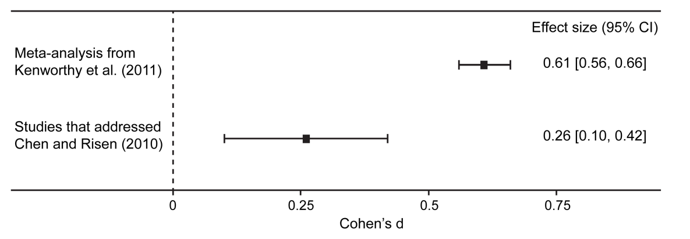

<head>
  <meta charset="UTF-8">
  <meta name="viewport" content="width=device-width, initial-scale=1.0">
  <title>
  Document
  </title>
  <link rel="stylesheet" type="text/css" href="https://ryu-thakahashi.github.io/css/article.css">
</head>

<thetitle>認知的不協和での実験パラダイム</thetitle>
 
<subtitle>自由選択パラダイムの問題点と代替案、および具体例</subtitle>

**目次**

- [認知的不協和理論(Cognitive Dissonance Theory)とは](#認知的不協和理論cognitive-dissonance-theoryとは)
  - [Cognitive Dissonance Theoryとは？](#cognitive-dissonance-theoryとは)
  - [CDTを支持する研究](#cdtを支持する研究)
  - [自由選択パラダイムとは？](#自由選択パラダイムとは)
- [Izuma & Murayama (2013)の指摘](#izuma--murayama-2013の指摘)
  - [自由選択パラダイムの何が問題なのか](#自由選択パラダイムの何が問題なのか)
  - [コンピューターシミュレーションの結果](#コンピューターシミュレーションの結果)
  - [上記の問題を解決したパラダイム](#上記の問題を解決したパラダイム)
  - [結果](#結果)
  - [本研究が過去の知見に与える影響](#本研究が過去の知見に与える影響)
- [自由選択パラダイム以外のパラダイム](#自由選択パラダイム以外のパラダイム)
  - [Blind Choice Paradigm](#blind-choice-paradigm)

<!-- Introduction -->

# 認知的不協和理論(Cognitive Dissonance Theory)とは

## Cognitive Dissonance Theoryとは？
Cognitive Dissonance Theory(CDT)とは、人間の態度の変化を説明する理論である。CDTによると、人はある対象に対して対立する態度をもつとき（i.e., 認知的不協和状態にあるとき）、耐え難いほどの不快な感情を抱く。その不快感情を解消するため（あるいは自己の一貫性を保つため）に、人はその対象に対する行動や信念といったイメージを変化させ、結果的に態度を変化させるとするのがCDTである。ただし、一般的に行動を変化させるのは困難であり、たとえ可能であったとしても信念を変化させるほうが容易なので、人間は主として信念を変化させると考えられる。たとえば、喫煙者は喫煙に対して「喫煙をしている」行動と「喫煙は健康に悪い」認知という２つの対立した態度を持っている（態度は感情的成分、行動的成分、認知的成分で分類されると言われているため、行動と認知とした）。このとき喫煙者は自己の一貫性を保つため（i.e., 認知的不協和を解消するため）に、どちらかを変化させる。喫煙行動は認知に対して変化させるのが困難なので、喫煙者は「喫煙をすることによってストレスが解消される」と考える。上記のようなプロセスによって人間は態度を変化させるとするのが、CDTである。

## CDTを支持する研究
CDTに関する実証研究は、CDTが提唱されて以来60年ほど行われており、中でもchoice-induced preference change(選択による選好の誘導？)は繰り返し再現されている(実験研究では、e.g., Brehm, 1956; Gerard & White, 1983; Steele et al., 1993　fMRI研究では、e.g., Sharot et al., 2009, 2012; Jarcho et al., 2011; Kitayama, et al., 2012)。Izuma et al. (2010)は、参加者に対して160個の食品(e.g., チップスター、オレオ)に対する好みを8段階（1＝全く好きでない、8＝とても好き）で評価させた(first rating task)後に、160の食品から2つの食品を提示させ、どちらが好ましいかを回答させた(choice task)。なお、choice taskの際、被験者内でコンピューター条件(赤枠で囲まれた方を選択してください)と自己選択条件(自分の好みの方を選択してください)の2つの条件が設定された。choice taskの後、被験者は160の食品がその食品の評価(コンピュータが選んだ or 拒否した、もしくはあなたが選んだ or 拒否した)と一緒に提示され、その食品について評価を行った(second rating task)。その結果、被験者の線条体(報酬が与えられたときに賦活する部位。機能的特異性も一貫性も高い)の活動は選好評定値の差が0もしくは1の食品に対して自分が拒否したとき、抑制された（下図参照）。

Izuma et al. (2010)でも用いられている実験手続きは自由選択パラダイムと呼ばれ、CDTを検証する実験手続きとして最も頻繁に利用されてきたパラダイムである。しかし、自由選択パラダイムの手続きに重大な問題があることが指摘されている(Chen & Risen, 2010)。以下ではまず、自由選択パラダイムの手順を示し、Izuma & Murayama (2013)をまとめることで自由選択パラダイムの何が問題であり、その問題が過去の知見にどれほどの影響を与えるのかについて示す。その後、Chen & Risen (2010)が妥当であると示したパラダイムとそれを実施した研究、およびその他のパラダイムを、それぞれのメリット、デメリットと共に紹介する。

## 自由選択パラダイムとは？
自由選択パラダイムとは、以下の手順に従って実施される実験パラダイムである。

  1. まずはアイテムを複数提示する
  2. リッカート尺度で好意度を評価(first rating task)
  3. アイテムのうち、同じ評価の２つを提示(choice task)
     - ２つのうち、一つを持ち帰っていいと自由に選択させる
  4.  もう一度、すべてのアイテムについて好意度を評価(second rating task)

多くの研究によって、first rating taskとsecond rating taskのアイテム$i$に対する選好$u_i$はchoice taskで選択された（あるいは拒否された）かどうかによって変化することが示されている。このような経験的(empiricalな)証拠だけでなく、メタ分析によっても選択による選好の変化が存在することが示されており、Kenworthy et al., (2011)によると、その効果量はd = .61[.56, .66]であった。

# Izuma & Murayama (2013)の指摘

## 自由選択パラダイムの何が問題なのか
自由選択パラダイムは数多くの研究で行われてきたが、クリティカルな問題が存在することも指摘されている(Chen & Risen, 2010)。その問題とは、このパラダイムでは、選択による真の選好の変化を測定できていないという問題である。Chen & Risen (2010)は数学的方法によって、たとえ選好が変化せずとも、選好の回答が変化することは示されている（原典は確認しましたが難しすぎたのでよくわからず。数学の定理として証明できるとのこと）。

本研究では、コンピューターシミュレーションによってC&Rの知見が正しいかを検証した。具体的には以下の条件で実施した。

1. 真の選好はパラダイムを通して変化しない
  - スケールはリッカート尺度で[1, 10]
  - Aに対する真の選好 ~ $N(6.5, .5)$
  - Bに対する真の選好 ~ $N(7.5, .5)$
2. AとBは、約23%の確率でどちらも7と選択される(first rating task)
  - mean + SDの面積(確率)は、.477
  - よって、.477^2 = 約.23
3. Bが選択される(choice task)
  - 真の選好の平均値は A < Bであるため
4. 両者の差が広がる(second rating task)
  - （選択されたことによって）Bは7よりも大きくなる
  - （選択されなかったことによって）Aは7よりも小さくなる

Izuma & Murayama (2013)より引用

## コンピューターシミュレーションの結果

$u_A$と$u_B$の平均値の差が2ある時のみ、交互作用効果(choice-induced preference change)はなかった。

## 上記の問題を解決したパラダイム
C&Rでは、適切なパラダイムも提唱されている。それは以下の３つである。これらのパラダイムの問題点、および具体的な手順や実際の実験例は後述する。

- Blind Choice Paradigm
- Rate-Rate-Choice Paradigm
- Implicit Choice Paradigm

Kenworthy et al. (2011)では、自由選択パラダイムの研究が多く含んだメタ分析であった。そのため、コンピューターシミュレーションの結果のように、選択による選考の変化を過大に見積もっている可能性がある。そこで、本研究ではKenworthy et al. (2011)の結果が過大に見積もられているかを検証するため、C&Rで提唱されたパラダイムのみを対象にしてメタ分析を実施した。

## 結果

本研究において推定された効果量がKenworty et al. (2011)よりも小さいこと（および、信頼区間の幅が増加していること）からわかるように、自由選択パラダイムは、選択による選好の変化を過大に推定していると考えられる。本研究のコンピューターシミュレーションやメタ分析の結果から、今後のCDT研究において自由選択パラダイムを用いることは避けたほうが良いだろう。

## 本研究が過去の知見に与える影響
本研究の結果は、自由選択パラダイムを用いた過去の知見の妥当性が高くないことを示唆している。一方で今回の議論（批判）は、自由選択パラダイムだけにとどまらず、例えば個人差()や文化差()を対象とした研究、さらにはIAT()、脳活動()を測定した研究の妥当性にも疑問を投げかけるものである。また、C&Rにも以下のような問題点がある。

- Blind (Illustration of) Choice Paradigmは、そもそも真の選好を性格に測れていない可能性(Risen & Chen, 2010)
- Rate-Rate-Choice Paradigmは、再現性可能性が低い(Risen & Chen, 2010)
  - そのままやっても有意差は見られず、意味づけや重要性の増加を操作しても有意差でない
- Implicit Choice ParadigmはChoiceによるバイアスを避けられない(Risen & Chen, 2010)

本研究の結果は、今後のCDT研究において自由選択パラダイムは避けたほうが良いこと、より妥当な検証方法を探索していくこと、そして結果の解釈においてはより慎重になることの重要性を示唆している。なお、今回の知見は認知的不協和による選好の変化を否定するわけではなく、(C&Rでは存在について言及されてはいないが、)むしろ存在することを示していることは注意されたい。

# 自由選択パラダイム以外のパラダイム
ここまでは、Izuma & Murayama (2013)の指摘をまとめることで、自由選択パラダイムの問題点を明らかにし、代替的な実験方法の探索と採用が重要であることを示してきた。以下ではIzuma & Murayama (2013)が妥当であると考えるパラダイムの手順、実際の実験例、自由選択パラダイムの問題点を改善している点(メリット)および問題点(デメリット)についてまとめる。

## Blind Choice Paradigm
Blind Choice Paradigmとは、以下の手順で実行されるパラダイムのことである。

- 自由選択パラダイムと同様に、first rating taskを実施する
- choice taskにて、選択者のもとの選好を反映せず選択させる
  - Sharot et al. (2010)では、意味のない文字列のどちらが良いか選ばせる
- その後、自由選択パラダイムと同様にsecond rating taskを実施する

Blind Choice Paradigmを実施した研究として、Sharot et al. (2010)がある。Sharot et al. (2010)では、80の休暇先(e.g., )を刺激として用いている。実験手順としてはまず、選択前評価課題(first rating task)が行われた。このセクションでは最初に休暇先の名称が6秒間画面に表示された。参加者はその間、「来年の休暇をその場で過ごすことを想像するよう」指示された。その後、2秒間でどの程度幸せか(1-不幸、2-少し不幸、3-中立、4-幸せ、5-非常に幸せ、6-非常に幸せ)を回答させ、残りの三秒間は固定十字を提示した。この1回あたり11秒間の試行を80回行うことで選択前評価課題を終えた。次にサブリミナル意思決定課題(Blind choice task)が行われた。この課題ではまず、無意味な文字列(e.g., “%^!x *&()%)を2msだけ、画面の右と左に提示する。その後、2つの休暇先についての文字が提示され、「どちらの休暇先(右の休暇先か、左の休暇先か)が良いか」を選択させた。ただし、ここでも旅行先についての文字列は提示していない。被験者が選択したあと、ランダムに休暇先の組を提示して(e.g., ギリシャ - タイ)、被験者が押した方向の休暇先に星マークをつけた。最後に、選択後評価(second rating task)を選択前評価と同様に実施した。その結果、被験者は盲目的（i.e., 選好を反映していない）にもかかわらず、選択した方の選好がfirst rating taskよりも高くなったが、拒否した休暇先についてはfirst rating taskと変わらなかった。

