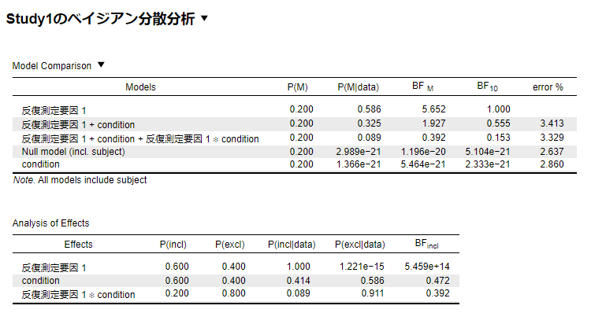
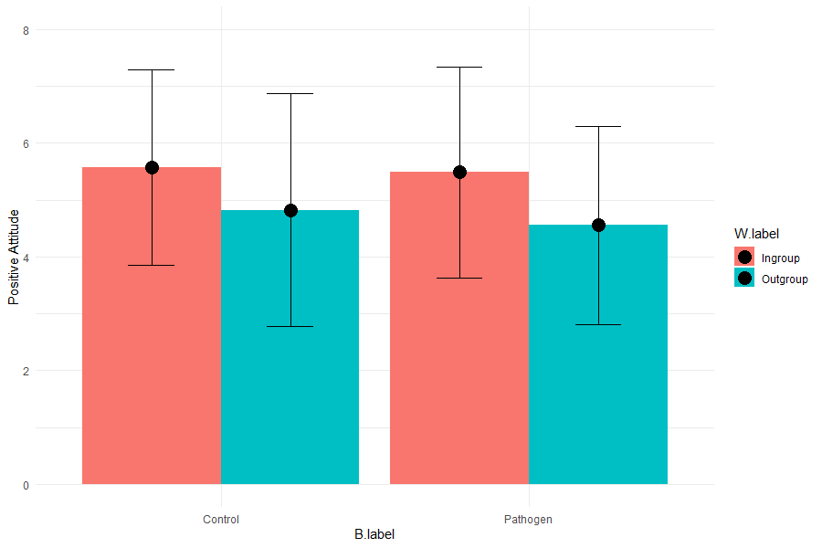

Behavioral immune systems:BIS)とは？
個人が環境中の病原体を検知し、これらの病原体が体内に侵入するのを防ぐ行動を動機付けることを可能にする心理的メカニズムの集合体(van Leeuwen & Petersen, 2018)のこと

集団の同質性に関する理論は、なぜ社会集団は決裂しているのかを説明する理論である。
特にBISは、人には新しい病原菌を忌避するための行動的な免疫システムがあり、具体的には
1. 集団間の相互作用は、新しい病原菌に感染するリスクを高める
2. 集団内の社会規範は、ローカルな病原菌の感染を低くする可能性

このような理由によって集団間バイアスは生じるのだと、assortative sociality理論は主張している。

さらに、assortative sociality理論を支持する結果は複数ある。(van Leeuwen & Petersen, 2018)
- 病原体嫌悪感度は、出身地不詳の移民と病原体の多い生態系からの移民両方が入国許可に対して負の影響を与えた(Ji et al., 2019)
- 嫌悪の感情と反移民感情は、「その移民は地域の規範に同化している」と言われたとき相関しなかった(Karinen et al., 2019)

しかし、この理論にはいくつかの問題がある
1. 祖先の環境では(新たな病原菌の可能性を持つ、よく知らない)外集団との交流は多くなかったはず
2. 集団内で誰かが感染すれば集団の殆どが感染するため、最小限の相互作用がある状況では外集団忌避に意味はないはず

すなわち、この理論は外集団忌避は、衛生の文化的習慣における集団間差異のために適応的だったとする可能性を排除していない。
実際、van Leeuwen & Petersen (2018)は、実際の感染驚異(e.g. rash, lesion)は会話の居心地を減少させるものの、異なる人種への態度変化(外集団忌避)は見られないことを示した。

これまでの研究は特定の集団に関するステレオタイプを用いていたため(e.g. Ji et al., 2019)、ある集団が特定の集団に持つ偏見を示しているに過ぎなかった。
BISが正しいならば、たとえ存在しない集団であっても、病原菌の暴露をプライムされることで偏見は生じるはずである。
そこで、BISが既存の集団に対する偏見ではなく、意味のない外集団でもassortative socialityが促進されるかどうかを検討するため、最小集団実験パラダイムを用いる。
もし、これで病原菌忌避のメカニズムが生じるなら、集団の同質性は高まるだろう。
もし、これで病原菌忌避のメカニズムが生じないなら、集団の同質性は変わらないだろう。

Study1
方法
性格の質問紙に回答してもらう
病原菌忌避条件では、感染した人の写真を見せた。
コントロール条件では、ニュートラルな住宅の写真
5分間のスライドショーでみせた。
質問紙を元に割り振る（実際はランダム）
結果
最小集団実験の操作は成功した(i.e. 個人タイプ評価と割り当てられたタイプの交互作用が有意)ものの、実験操作(pathogen vs. control)と評価(outgroup vs. ingroup)に交互作用効果なかった
（著者は）検出力が低かったために有意差が出なかったと主張

S2
S1の病原菌操作では、嫌悪と負の感情が病原菌脅威のためなのか、もっと一般的な負の感情によるものなのかを区別できない→non-pathogen条件(自然災害、事故等)の追加
結果
病原菌忌避の操作に主効果あり。
しかし、病原菌忌避と集団間バイアスの交互作用は見られなかった。
単語のポジティブさ評価でも、よく知っているかどうかの主効果はあったが、操作(pathogen vs. non-pathogen vs. control)の主効果はなかった。
後者については、刺激の生態学的妥当性が低かったからかもしれない…

結論：（最小条件集団実験において）病原菌のプライミングを行っても、社会の同質性は生じなかった。
※病原菌脅威が集団間バイアスを起こす可能性を除外したわけではない。

Study1

Study2

高橋の感想と課題
進化ゲーム理論にもとづいていなくても、適応的かどうかを批判できる
- この論文では、実証実験と背景を根拠とした
- 特にvan Leeuwen & Petersen (2018)の内容を参考にした？

理論を批判するためには、批判する理論を支持する結果やロジックを熟知しなければならない

想定される批判を回避するのは並大抵のことではない
- 検出力の小ささを言うだけで終わらず、サンプルサイズを設計して調査
- 結果が妥当となるような実験刺激(本論文では嫌悪刺激と単語)は批判の決め手

方法論に精通し、刺激のストックをためておくことが重要
- Study1のデータでベイズファクターを求めても、帰無仮説を支持する値は出ない
  - 私なら、「BFがいまいちなら危険だ。他の要因を検討したほうがいい」と思ってしまう
  - でも、検出力分析を知っていれば、批判を受け入れた上で反論可能
- 「要因Aではなく、要因Bである」という刺激は、実験のMethodを多く知らないと出てこない
  - 本研究では、病原菌プライムと、病原菌ではない嫌悪プライム

DeepLなしだと相当きつい
- Introductionは2回読んだが、2回とも解釈が異なった
- 1ページ読むのに60分ほどかかった
- それでも、論文を英語で読むことに対するハードルは下がった

課題
論文で出たサンプルサイズは1336ではなく1337が正しいですが…連絡とかしたほうがいいですかね…？

