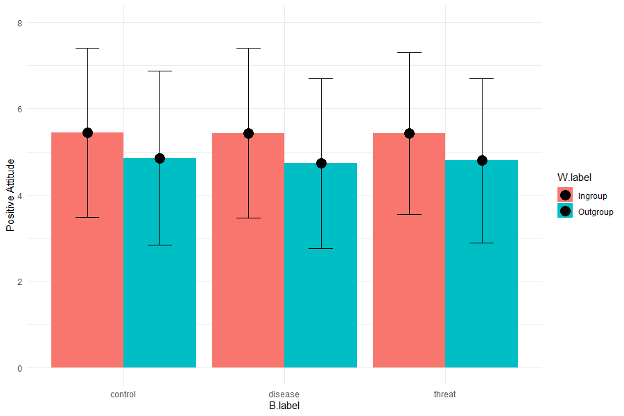

Abstract
（目的）病原体を忌避することは、現代の社会的な心的過程においても影響するだろう。（方法）そこで、大学生を対象とした予備実験のあと、事前登録した実験を実施した。（結果）予備実験で再現されなかったところもあったが、文化的ステレオタイプなしでも集団間の偏見は生じる可能性が示唆された。

Introduction
同質性の高い集団は、閉鎖的である。そのため、同質性の高い集団は伝染する病原菌を持つ可能性の高い外集団成員を助けないと考えられる。
これまでの研究は２つのタイプに分かれる。
1. 自民族中心主義 
2. 外国人排斥

これらの研究は特に、民族的・文化的文脈で行われてきた。
さらに、これらの実験は人種的・民族的外集団(中でも外国人観)に基づいた操作で行われてきた。
しかも、内集団と外集団の線引の個人差は、行き過ぎた道徳観と関連付けられてきた。

もし新しい病原菌の驚異が顕現されたとしたら、内集団成員と交流し、外集団とは避けることが適応的かもしれない。
病原菌の暴露よりも衛生面に関する文化差のほうが病原菌忌避は強かった（引用）。
だから、病原菌忌避の操作は暴露よりも文化差に関する操作のほうがいい（そのほうが集団の同質性を高める）かもしれない。
祖先の環境での”集団”とは、相互依存性の高さ等を示していたかもしれない。
けれども、現代では特定の集団だけに所属することが難しい環境にあるから、集団アイデンティティが顕現したときに内集団成員との相互依存性を高めたり、相互作用を望んだりするかもしれない。
そして、病原菌の驚異が顕現したときは、外集団を避け、内集団との相互作用を望むだろう。

批判
このassortative sociality perspectiveはおかしい。
1. 祖先の環境ではそれほど(病原菌の可能性を持つ)外集団との交流は多くないはず
   - ゆえに文化差が衛生面と関連する可能性(そしてその文化差が適応度を変化させた可能性)を排除していない
2. 新規の病原菌の適応的行動(外集団を避けること)は、すべての祖先にとって必要だったはず
   - 外集団を避けることが、(文化的な衛生において)適応的だった可能性を排除していない

ある研究では、実際の感染驚異(rash, lesion)は会話の居心地を減少させたが、異なる人種への態度は変化させなかった。

これまでの研究は特定の集団に関するステレオタイプを用いていて、一般化するのが難しかった。（つまり、ある集団が特定の集団に持つ偏見を示しているに過ぎない）

()は4つの研究を通して「病原菌が豊富な集団からの移民に対しては（移民の情報源を提示しない時と比べて）、健康の驚異を増大させ、安全性を低く見積もった」ことを示した。
しかし、この実験も民族や文化による違いによるものなのか、それとも一般的な集団のアイデンティティの違いによるものなのかに対して回答を与えていない。

実験によって生じた偏見が、既に存在する一般的な集団に対しての偏見ではないことを示すため、最小集団実験パラダイムを用いる。
もし、これで病原菌忌避のメカニズムが生じるなら、集団の同質性は高まるだろう。
もし、これで病原菌忌避のメカニズムが生じないなら、集団の同質性は変わらないだろう。

本研究の鍵は、実験の手続きが集団間バイアスを生じさせることである。
レジレポは、第一実験のデータ収集後、（つまり、第二実験の収集前に提出した）

Study1
方法
性格の質問紙に回答してもらう
病原菌忌避条件では、感染した人の写真を見せた。
コントロール条件では、ニュートラルな住宅の写真
5分間のスライドショーでみせた。
質問紙を元に割り振る（実際はランダム）
結果
最小集団実験の操作は成功した(i.e. 個人タイプ評価と割り当てられたタイプの交互作用が有意)ものの、実験操作(pathogen vs. control)と評価(outgroup vs. ingroup)に交互作用効果なかった
（著者は）検出力が低かったために有意差が出なかったと主張

S2
S1の病原菌操作では、嫌悪と負の感情が病原菌脅威のためなのか、もっと一般的な負の感情によるものなのかを区別できない→non-pathogen条件(自然災害、事故等)の追加
結果
病原菌忌避の操作に主効果あり。
しかし、病原菌忌避と集団間バイアスの交互作用は見られなかった。
単語のポジティブさ評価でも、よく知っているかどうかの主効果はあったが、操作(pathogen vs. non-pathogen vs. control)の主効果はなかった。
後者については、刺激の生態学的妥当性が低かったからかもしれない…

結論：（最小条件集団実験において）病原菌のプライミングを行っても、社会の同質性は生じなかった。
※病原菌脅威が集団間バイアスを起こす可能性を除外したわけではない。

高橋ならどうするか？
病原菌操作の主効果があったのは、(死ではない)脅威が生じたからでは？(Navarrete et al., 2004)

では、集団間バイアスと交互作用が生じそうな操作は？
課題の性質かな？(集団で解決できる課題なら交互作用。単なる自分自身への脅威なら主効果ないのでは？)
自尊心との関係性？（自尊心が低い人はソーシャルサポートを必要とするから、集団間バイアスを強化することで、自分の集団へのコミットを高める？）

目次
Makhanova et al. (inpress)のまとめ
本研究でも解決されてない課題
高橋が研究するなら？
   進化的にどう説明するか（病原菌忌避の代わりに…）
高橋の感想

Study1

Study2

Behavioral immune systemとは？
個人が環境中の病原体を検知し、これらの病原体が体内に侵入するのを防ぐ行動を動機付けることを可能にする心理的メカニズムの集合体である(van Leeuwen & Petersen, 2018)
「集団間の偏見って、行動的免疫システムによるものでは？」と言いたいときに使われるシステム

高橋の感想
