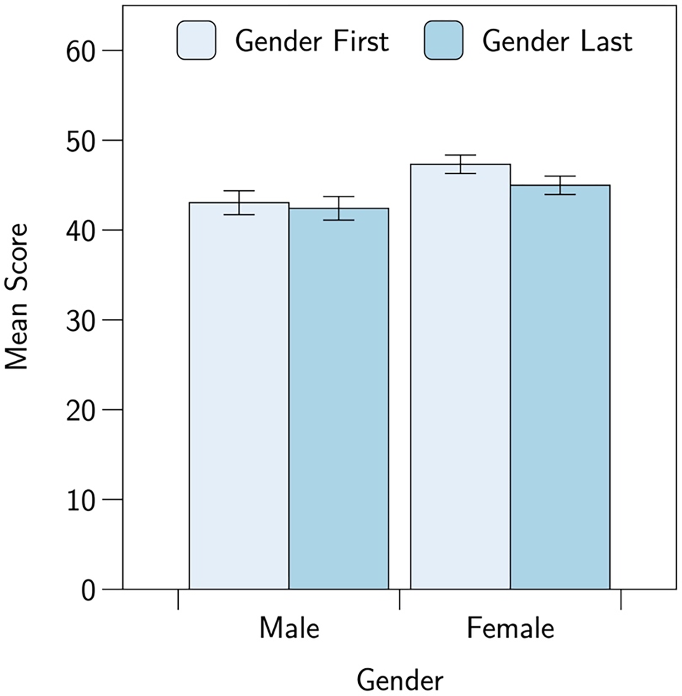
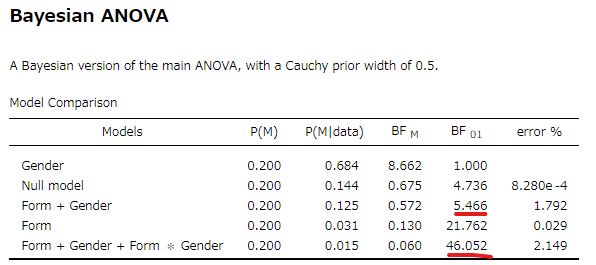

<thetitle>ステレオタイプ脅威の再現性</thetitle>
 
<subtitle>性別を尋ねる順番は、女性の数学の成績を下げるか？</subtitle>

**目次**

- [ステレオタイプ脅威](#ステレオタイプ脅威)
  - [ステレオタイプ脅威とはなにか？](#ステレオタイプ脅威とはなにか)
  - [ステレオタイプ脅威の問題点](#ステレオタイプ脅威の問題点)
  - [Stricker & Ward (2004)を巡る議論](#stricker--ward-2004を巡る議論)
  - [方法](#方法)
- [結果](#結果)
  - [聞く順番で成績は変わらない(交互作用に有意差なし)](#聞く順番で成績は変わらない交互作用に有意差なし)
  - [ベイズファクターも帰無仮説を採択(リンク)](#ベイズファクターも帰無仮説を採択リンクfilecusersmiffydownloadsall_1169_participants-resultshtml)
  - [補足](#補足)
- [高橋の感想と質問](#高橋の感想と質問)
  - [これぞ科学！な論文でした](#これぞ科学な論文でした)
  - [再現実験は、数で殴るだけじゃない](#再現実験は数で殴るだけじゃない)
  - [やっぱり、ベイズは強い](#やっぱりベイズは強い)
  - [ステレオタイプ脅威、やっぱり怪しい](#ステレオタイプ脅威やっぱり怪しい)

<!-- Introduction -->

# ステレオタイプ脅威

## ステレオタイプ脅威とはなにか？
ステレオタイプ脅威(stereotype threat)とは、「アイデンティティ付随条件の中でも（中略）目に見えない脅威」（スティール 訳・藤原, 2020）のことである。なお、アイデンティティ付随条件とは、「ある状況下で、特定の社会的アイデンティティを持つがゆえに（中略）対処しなければならない物事」（スティール, 2020）のことである。たとえば、女性(という社会的アイデンティティを持つ人)が数学の試験を受ける(という特定の状況下)で対処しなければならないことは、「女性は数学が苦手」という目に見えない脅威(i.e. ステレオタイプ脅威)である。『ステレオタイプの科学』という本はステレオタイプ脅威研究の第一人者であるスティール氏が著した書であり、ステレオタイプ脅威が様々な場面で大きな負の効果を持つことを多くの実験により示されている。今回紹介する論文は、そのスティール氏が発見したステレオタイプ脅威とその実験について、再現性を概念的に検証した研究である。

## ステレオタイプ脅威の問題点
ステレオタイプ脅威は、多くの研究で存在が示唆されている。

- 黒人に「認知能力をテストする」と宣言して難しい言語テストを行わせると成績が低下する。一方で、宣言しなかった方は白人と黒人に成績の有意差はなかった(Steele & Aronson, 1995)
- 数学ができる女性は、女性的特徴との関連を否定し、女性的特徴との関連が弱いと考えられるものは否定しない。ステレオタイプ驚異を顕現させるとこの効果は強まったが、数学ができない女性にはこの傾向見られなかった(Pronin et al., 2004)

一方で、ステレオタイプ脅威の存在に疑問を投げかける研究もある。

- Steele & Aronson (1995)の実験を再現できたと思われる研究の内、再現できたものは55%である。さらに再現できた研究に関してメタ分析したところ、**数学成績を調整した研究しか**ステレオタイプ脅威は見られなかった(Stoet & Geary, 2012)
- メタ分析により、女子学生におけるステレオタイプ脅威は**出版バイアスの可能性**があることが示された(Flore & Wichers, 2015)

再現性問題の中でも、Inglis & O'Hagan (2022)(今回紹介する論文)では特に（Steele and Aronson (1995)を追試した）Stricker & Ward (2004)の論文を巡る議論に着目し、論を進めている。

## Stricker & Ward (2004)を巡る議論
Stricker & Ward (2004)は、（黒人のステレオタイプを顕現させると黒人の認知成績が下がることを示した）Steele and Aronson (1995)の実験を追試した。AP Calculus AB(数学科目？)の問題を被験者に回答させた。回答させる際は最初に人種と性別を回答させる群、と最後に回答させる群に分けて検討した。成績を分析した結果、黒人、女性、その他のグループの生徒の成績には有意差なかった。

この論文に対し、反対論文を提出したのがDanaher & Crandall (2008)である。彼らはStricker & Ward (2004) の結果を再分析し、人種と性別を回答させることが大きな効果を持つと主張した。その効果の大きさは、性別に関する質問の順番を変えるだけでAP Caluculus AB(数学科目？)の単位を取得する米国人女性を毎年4,700人以上増加させるほどだという。さらに、Stricker & Ward (2004) の分析手法を「タイプⅠエラーではなく、タイプⅡエラーを生じさせる手法だ」(p.1642)と批判した。

その後すぐにStricker & Ward (2008)は、このDanaher & Crandall (2008)について論文で再反論した。彼らはDanaher & Crandall (2008)について、一部を恣意的に指摘しているために方向性が歪んでおり、統計的手法に対する批判は間違っている(数学の成績が正規分布ではないのに、標準特典に変換して成績が3以上の割合を求めている、白人が59%と割合が等しくないのに、セルの割合が等しい場合に用いられる最小二乗法での分散分析で検討しているなど)と指摘した(Stricker & Ward, 2008)。では、どちらの主張が正しいのだろうか。今回紹介するInglis & O'Hagan (2022)の目的は、Stricker & Ward (2004)の実験を別のテストで概念的に再現することで、ジェンダーに関する質問を最初にしても女性の成績はしないことを示すことである。

## 方法
- イギリスで全国的に行われている数学のテスト(JMC)を用いてテスト
- 5 つの学校に通う、11-13才の生徒を対象とした
- 2種類の解答用紙(genderを最後 vs. 最初に聞く)を配布
  - 用紙の順をランダムにし、配るときは順番に
- ANOVA(ベイジアンも)、multi levelをプレレジした上で分析
  - 探索的に女子校(1校)を除外しても分析

# 結果

## 聞く順番で成績は変わらない(交互作用に有意差なし)

## ベイズファクターも帰無仮説を採択([リンク](file:///C:/Users/Miffy/Downloads/All_1169_Participants-results.html))

## 補足
成績の平均値は女性の方が高かったので(p=.004)、女子校を除外したら、男性の方がわずかに高かった(d = .165)。
しかし、どちらのサンプルでも交互作用は有意ではない。
この結果で80%の検出力を想定すると、η=.0065になる(小さすぎる)。

# 高橋の感想と質問

## これぞ科学！な論文でした
<impression>
この論文は、「ステレオタイプ脅威ある！→いや、ない！→ないなんてことはない！分析が間違ってる！→いやいや、その指摘が間違ってる！」という流れの中で、分析のようなテクニカルな水掛け論ではなく、概念的に再現されるかを検証した論文でした。概念的な妥当性はもちろん、分析の方法論も非常に精緻で、まさに科学の発展を実感させる内容でした。すごい。
</impression>

## 再現実験は、数で殴るだけじゃない
<impression>
再現実験といえば、TMTのようなMany lab＋提唱者を混ぜた有無を言わせない研究だという印象でした。しかし、この論文のように、概念的に検討することも立派な再現実験であり、心理学のメインストリートに逆らう方法には、こんなやり方もあるんだな～と勉強になりました。
</impression>

## やっぱり、ベイズは強い
<impression>
帰無仮説を積極的に採択できることで、再現可能性が低い理論や実験を科学的に淘汰できるのはものすごく強いなと。ベイズファクターがあることで「差があるとは言えないという証拠は見つけられなかった」などという言い訳は通じません。本当に心強い指標であるとともに、これからの心理学(を担う僕ら若者)の強い味方だなと。
</impression>

## ステレオタイプ脅威、やっぱり怪しい
<impression>
今回の論文では「性別を回答させる順番の効果」が再現されなかっただけであり、 ステレオタイプ脅威がないとは言ってないです。ただ、社会的不平等に社会的カテゴリーは必要ないこと(それに付随する社会的アイデンティティも必要ないこと)を考えると、理論的にも欠陥があるよなーと感じました。
</impression>

